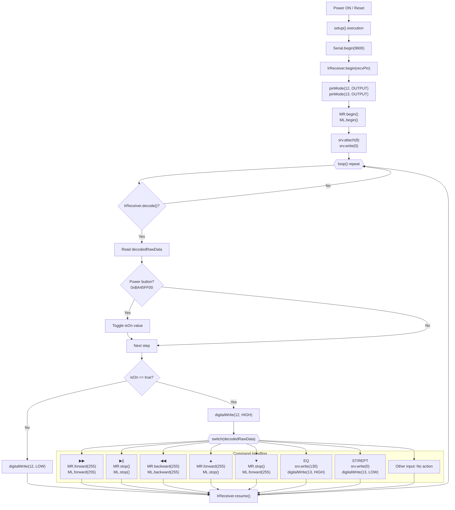

```mermaid
%%{init: { "flowchart": { "rankDir": "TB", "nodeSpacing": 12, "rankSpacing": 30 } }}%%
flowchart TB
    %% ---------- Basic Nodes ----------
    Start["Power ON / Reset"]
    Setup["setup() execution"]
    A1["Serial.begin(9600)"]
    A2["IrReceiver.begin(recvPin)"]
    A3["pinMode(12, OUTPUT)<br/>pinMode(13, OUTPUT)"]
    A4["MR.begin()<br/>ML.begin()"]
    A5["srv.attach(8)<br/>srv.write(0)"]
    Loop{{"loop() repeat"}}
    CheckIR{"IrReceiver.decode()?"}
    ReadIR["Read decodedRawData"]
    TogglePower{"Power button?<br/>0xBA45FF00"}
    TP["Toggle isOn value"]
    AfterPower["Next step"]
    IsOn{"isOn == true?"}
    LEDoff["digitalWrite(12, LOW)"]
    LEDon["digitalWrite(12, HIGH)"]
    Switch{{"switch(decodedRawData)"}}
    Resume["IrReceiver.resume()"]

    %% ---------- Command Handling ----------
    subgraph Commands["Command Handling"]
        direction TB
        Case1["▶▶<br/>MR.forward(255)<br/>ML.forward(255)"]
        Case2["▶||<br/>MR.stop()<br/>ML.stop()"]
        Case3["◀◀<br/>MR.backward(255)<br/>ML.backward(255)"]
        Case4["▲<br/>MR.forward(255)<br/>ML.stop()"]
        Case5["▼<br/>MR.stop()<br/>ML.forward(255)"]
        Case6["EQ<br/>srv.write(130)<br/>digitalWrite(13, HIGH)"]
        Case7["ST/REPT<br/>srv.write(0)<br/>digitalWrite(13, LOW)"]
        Default["Other input: No action"]
    end

    %% ---------- Main Flow ----------
    Start --> Setup --> A1 --> A2 --> A3 --> A4 --> A5 --> Loop
    Loop --> CheckIR
    CheckIR -- No --> Loop
    CheckIR -- Yes --> ReadIR --> TogglePower
    TogglePower -- Yes --> TP --> AfterPower
    TogglePower -- No --> AfterPower
    AfterPower --> IsOn
    IsOn -- No --> LEDoff --> Resume
    IsOn -- Yes --> LEDon --> Switch

    %% Switch Branches
    Switch --> Case1
    Switch --> Case2
    Switch --> Case3
    Switch --> Case4
    Switch --> Case5
    Switch --> Case6
    Switch --> Case7
    Switch --> Default

    %% Case End → Resume → Loop
    Case1 --> Resume
    Case2 --> Resume
    Case3 --> Resume
    Case4 --> Resume
    Case5 --> Resume
    Case6 --> Resume
    Case7 --> Resume
    Default --> Resume

    Resume --> Loop
```
